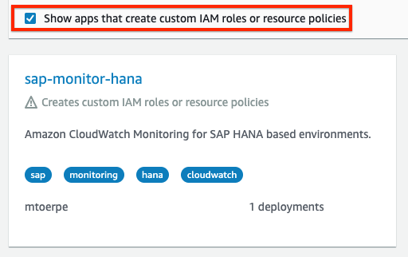
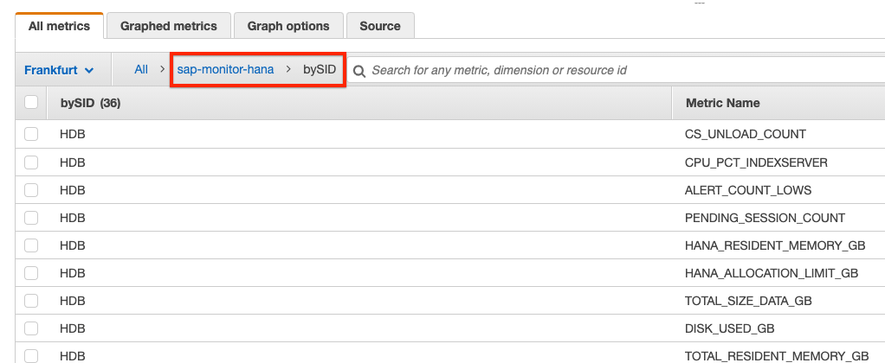

# Setting it up

## Step 1: Create a SAP HANA User for Monitoring (HANA Studio)

Please refer to the [user setup guide](Create_SAP_Monitoring_User.md).

## Step 2: Deploy the solution (AWS console)

For some AWS Regions (eu-central-1, us-west-1, us-west-2, us-east-1, us-east-2), you can easily deploy the solution with the [AWS Serverless Application Repository](https://eu-central-1.console.aws.amazon.com/serverlessrepo/home?region=eu-central-1#/available-applications) by searching for **sap-monitor-hana**. Make sure to tick **Show apps that create custom IAM roles**.

If this is not working in your AWS Region, please deploy it manually by downloading and running one of the following AWS CloudFormation templates
- [Frankfurt (eu-central-1)](https://github.com/aws-samples/amazon-cloudwatch-monitor-for-sap-hana/blob/master/packaged.yml)
- [North Virginia (us-east-1)](https://github.com/aws-samples/amazon-cloudwatch-monitor-for-sap-hana/blob/master/packaged_us_east_1.yml)
- [Oregon (us-west-2)](https://github.com/aws-samples/amazon-cloudwatch-monitor-for-sap-hana/blob/master/packaged_us_west_2.yml)



Please carefully fill out all the necessary details, such as SAP HANA ID, Host/IP-Address, Instance ID, DB User/Password as well as Security Group(s) and Subnet(s) of your target VPC. Compare your inputs also with the respective EC2 settings for your SAP HANA system. For single tenant systems, you might need to use SYSTEMDB instead of SAP HANA ID as SAPSIDParameter!

**Note:** You will have to deploy a single instance of this application per SAP HANA ID, if multiple systems shall be monitored!


In case of issues, please refer to the [Troubleshooting](Troubleshooting.md) guide. 

## Step 4: Test the function

Open the Lambda console, select **sap-monitor-hana-\<SID\>** and choose **Test**. In the **Configure test event** page, choose **Create new test event** and enter

```json
{"refresh":"true"}
```


Hit **Test**. The expected output is shown below:


In case of issues, refer to the [Troubleshooting](Troubleshooting.md) guide.

## Step 5: Enable the Scheduler

Open the Amazon CloudWatch console. In the navigation pane, choose **Rules**. Select the rule **sap-monitor-hana-\<SID\>** and choose **Enable** as **Actions**, so that it runs periodically: 


## Step 6: Create a dashboard

Open the Amazon CloudWatch console. In the navigation pane, choose Metrics. Under Custom Namespaces, you should now find your custom metrics, arranged by SID. You can select any metric and preview its output.



Navigate to Dashboards and press Create dashboard to setup a new custom dashboard. Choose Add widget and select the respective custom metrics from the list. Make sure to match the granularity and period. 

The resulting dashboards can look as follows


A sample dashboard xml file can be found [here](../assets/dashboard.xml). When importing make sure to adjust region ('eu-central-1) and SID ('HDB') accordingly.

By the way, if desired, CloudWatch even allows you to [embed graphs](https://aws.amazon.com/de/blogs/devops/building-an-amazon-cloudwatch-dashboard-outside-of-the-aws-management-console/) into your webpage.

## Step 7: Create alarms

You can now create alarms and receive notifications, once desired thresholds are exceeded.

Start with a simple alarm to monitor the sap-monitor-hana itself, by selecting the Lambda metric **Errors** for function **sap-monitor-hana-\<SID\>** as follows
 


If you set up a corresponding [Amazon Simple Notification Service](https://docs.aws.amazon.com/AmazonCloudWatch/latest/monitoring/US_SetupSNS.html) (Amazon SNS) topic, you can choose to be notified via email when the monitoring is failing. Proceed with other alarms for metrics, that you like to closely pay attention to.
